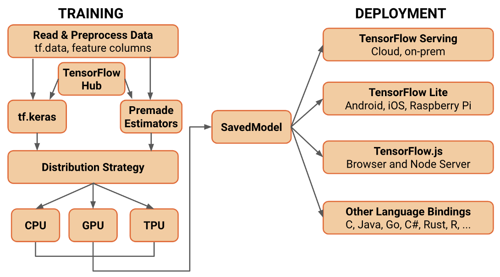

# Awesome Tensorflow 2 💛 
A curated list of awesome Tensorflow v2 tutorials, blogs, and projects.

# 👉 Contents <a name="TOC" />👈

<!-- MarkdownTOC depth=4 -->
* [What are the advantages of TensorFlow v2 ?](#firstSection)
* [Official Site](#official)
* [Tutorials](#GitHub-tutorials)
* [SampleCodes/Projects](#sample)
    * [General](#GeneralCode)
    * [Specific Model/Task (like GAN,RL,NLP,...)](#SpecificCode)
        * [Reinforcement Learning](#RL)
        * [GAN](#GAN_Code)
        * [NLP](#NLP_Code)
        * [Object Detection](#OD)
        * [Other](#Other_Code)
* [Videos](#videos)
    * [TensorFlow World 2019](#TFW19)
    * [DevSummit 2019](#DevSum)
    * [Google I/O 2019](#GIO)
    * [TensorFlow YouTube Channel](#TYC)
    * [Course](#course)
    * [Other](#Other_Video)
* [Blog posts](#blogs)
* [Other](#other)
   * [Python wheels](#whls)
   * [Tools](#tools)
   * [#PoweredByTF 2.0 Challenge](#PWBYTF2)
   * [Books](#books)
   
<!-- /MarkdownTOC --> 

<a name="firstSection" />

## What are the advantages of TensorFlow v2 ? 👀
* TensorFlow 2 focuses on simplicity and ease of use, with updates like eager execution, intuitive higher-level APIs, and flexible model   building on any platform
* There are multiple changes in TensorFlow 2 to make TensorFlow users more productive. TensorFlow 2 removes redundant APIs, makes APIs more consistent (Unified RNNs, Unified Optimizers), and better integrates with the Python runtime with Eager execution.

More info [here](https://www.tensorflow.org/tutorials).

TensorFlow 2.1 is now available! 🎉🎉🎉

For Tensrflow **version <1.x>** see this **[awesome collection](https://github.com/jtoy/awesome-tensorflow)** created by jtoy.

<a name="official" />

## Official Site 🏢 
* [TensorFlow 2.1](https://www.tensorflow.org/)
* [Install](https://www.tensorflow.org/install/gpu) (Needs CUDA 10.1 & cuDNN = 7.6)
* [Effective_tf2](https://www.tensorflow.org/guide/effective_tf2)
* [Quick Start](https://www.tensorflow.org/tutorials/quickstart/beginner)
* [Upgrade guid](https://www.tensorflow.org/guide/upgrade)
* [Road map](https://www.tensorflow.org/community/roadmap)
* [FAQ](https://github.com/tensorflow/community/blob/master/sigs/testing/faq.md)
* [Blog](https://blog.tensorflow.org/)

[  **Back to Top**](#TOC)    

## Tutorials <a name="GitHub-tutorials" /> 📕 📘 📗 📓

* [TensorFlow Tutorial](https://github.com/aymericdamien/TensorFlow-Examples/tree/master/tensorflow_v2) 
* [Official tutorial](https://github.com/tensorflow/docs/tree/master/site/en/tutorials) 
* [Deep Learning with TensorFlow 2 and Keras course](https://github.com/ageron/tf2_course) 
* [TensorFlow-2.x-Tutorials](https://github.com/dragen1860/TensorFlow-2.x-Tutorials) 
* [Tensorflow2_tutorials_chinese](https://github.com/czy36mengfei/tensorflow2_tutorials_chinese) 
* [Tensorflow2.0 tutorial from basic to hard](https://github.com/YunYang1994/TensorFlow2.0-Examples) 
* [TensorFlow2.0_Eager_Execution_Tutorials](https://github.com/hellocybernetics/TensorFlow2.0_Eager_Execution_Tutorials) 
* [Tensorflow 2.0 and Keras: what's new, what's shared, what's different](https://github.com/zerotodeeplearning/tf2_keras) 
* [Practical Exercises in Tensorflow 2.0 for Ian Goodfellows Deep Learning Book](https://github.com/adhiraiyan/DeepLearningWithTF2.0) 
* [Deep Learning Crash Course-(S9)](https://github.com/isikdogan/deep_learning_tutorials) 

[  **Back to Top**](#TOC) 

## Sample Codes / Projects <a name="sample" /> ⛏️📐📁

   ### General 🚧 <a name="GeneralCode" />
   
   * [Tensorflow-2.0 Quick Start Guide](https://github.com/PacktPublishing/Tensorflow-2.0-Quick-Start-Guide)
   * [Make Money with Tensorflow 2.0](https://github.com/llSourcell/Make_Money_with_Tensorflow_2.0)
   * [Practical intro to tf2](https://github.com/himanshurawlani/practical_intro_to_tf2)
   * [Tensorflow2.0 examples](https://github.com/thibo73800/tensorflow2.0-examples)
   * [Deep Learning with TensorFlow 2.X (& Keras)](https://github.com/yusugomori/deeplearning-tf2)
   * [TensorFlow 2 Machine Learning Cookbook, published by Packt](https://github.com/PacktPublishing/TensorFlow-2-Machine-Learning-Cookbook)
   * [Hands On Computer Vision with TensorFlow 2](https://github.com/PacktPublishing/Hands-On-Computer-Vision-with-TensorFlow-2)
   * [Implementing-Deep-Learning-Algorithms-with-TensorFlow-2.0(PacktPub)](https://github.com/PacktPublishing/Implementing-Deep-Learning-Algorithms-with-TensorFlow-2.0)
   * [Discovering hidden factors of variation in deep networks](https://github.com/Warvito/discovering-hidden-factors-of-variation-in-deep-networks)
   * [Tutorial to run TensorFlow 2 on mobile devices: Android, iOS and Browser](https://github.com/EliotAndres/tensorflow-2-run-on-mobile-devices-ios-android-browser)
   * [Tensorflow2.x Examples from basic to hard](https://github.com/YunYang1994/TensorFlow2.0-Examples)
   * [Deep-Learning-with-TensorFlow-2.0-in-7-Steps-[Packt]](https://github.com/PacktPublishing/Deep-Learning-with-TensorFlow-2.0-in-7-Steps)
   * [Getting-Started-with-TensorFlow-2.0-for-Deep-Learning-Video-[Packt]](https://github.com/PacktPublishing/Getting-Started-with-TensorFlow-2.0-for-Deep-Learning-Video)
   * [TensorFlow 2.0: A Complete Guide on the Brand New TensorFlow - Udemy Course](https://github.com/sergejhorvat/Tensorflow2.0_Udemy)
   * [Interpretability Methods for tf.keras models with Tensorflow 2.0](https://github.com/sicara/tf-explain)
   * [AiSpace: Better practices for deep learning model development and deployment For Tensorflow 2.0](https://github.com/yingyuankai/AiSpace)
   * [Multi-Similarity Loss Re-Implementation in Tensorflow 2.x](https://github.com/shun-lin/multi-similarity-loss-tensorflow)
   * [Deep Learning with TensorFlow 2 and Keras - 2nd Edition PacktPub](https://github.com/PacktPublishing/Deep-Learning-with-TensorFlow-2-and-Keras)
   * [Graph Neural Networks in TF2 (TensorFlow 2 library implementing Graph Neural Networks by Microsoft)](https://github.com/microsoft/tf2-gnn)
   
   ### Specific Model/Task (like GAN,RL,NLP,...) <a name="SpecificCode" />
   
   ### Reinforcement Learning <a name="RL" />🔮
   * [Play Super Mario Games using Reinforcement Learning with TensorFlow 2.0](https://github.com/james94/Super-Mario-Reinforcement-Learning)
   * [TensorFlow2.0 Reinforcement Learning Library!(TF2RL)](https://github.com/keiohta/tf2rl)
   * [Scalable and Efficient Deep-RL](https://github.com/google-research/seed_rl)
   * [Deep Reinforcement Learning with TensorFlow 2.0](https://github.com/inoryy/tensorflow2-deep-reinforcement-learning)
   * [Implemented Policy Gradient in Tensorflow2.0](https://github.com/wongongv/PolicyGradient_in_tensorflow2.0)
   * [TF2 PPO Atari](https://github.com/UesugiErii/tf2-PPO-atari)

   #### GAN <a name="GAN_Code" />🌄
   * [Generative models in Tensorflow 2](https://github.com/timsainb/tensorflow2-generative-models/)
   * [CycleGAN-Tensorflow-2](https://github.com/LynnHo/CycleGAN-Tensorflow-2)
   * [CartoonGAN](https://github.com/mnicnc404/CartoonGan-tensorflow)
   * [GANs - Tensorflow 2](https://github.com/LynnHo/DCGAN-LSGAN-WGAN-GP-DRAGAN-Tensorflow-2)
   * [Fast-SRGAN (Single Image Super Resolution GAN)](https://github.com/HasnainRaz/Fast-SRGAN)
   * [Enhanced Super-Resolution Generative Adversarial Networks](https://github.com/peteryuX/esrgan-tf2)
   
   #### NLP <a name="NLP_Code" />🌈
   * [Transformers: State-of-the-art Natural Language Processing for TensorFlow 2.0 and PyTorch](https://github.com/huggingface/transformers)
   * [Tensorflow 2 implementation of Causal-BERT](https://github.com/vveitch/causal-text-embeddings-tf2)
   * [Effective NLP in TensorFlow 2](https://github.com/zhedongzheng/finch)
   * [Effective Approaches to Attention-based Neural Machine Translation](https://github.com/thisisiron/nmt-attention-tf2)
   * [BERT in TensorFlow 2](https://github.com/tensorflow/models/tree/master/official/nlp/bert)
   * [A Keras TensorFlow 2.0 implementation of BERT, ALBERT and adapter-BERT](https://github.com/kpe/bert-for-tf2)
   
   #### Object Detection <a name="OD" />🔥
   * [MobileNet_V3](https://github.com/calmisential/MobileNetV3_TensorFlow2.0)
   * [YOLO v3](https://github.com/zzh8829/yolov3-tf2)
   * [Tensorflow Object Detection with Tensorflow 2.0](https://github.com/TannerGilbert/Tensorflow-Object-Detection-with-Tensorflow-2.0)
   
   #### Other <a name="Other_Code" />🚦
   * [A tensorflow2 implementation of some basic CNNs(MobileNetV1/V2/V3, EfficientNet, ResNeXt, InceptionV4, InceptionResNetV1/V2, SENet, SqueezeNet, DenseNet, ShuffleNetV2, ResNet). ](https://github.com/calmisential/Basic_CNNs_TensorFlow2) <==
   * [fast and scalable design of risk parity portfolios with TensorFlow 2.0](https://github.com/dppalomar/riskparity.py)
   * [Tensorflow 2.0 Realtime Multi-Person Pose Estimation](https://github.com/michalfaber/tensorflow_Realtime_Multi-Person_Pose_Estimation)
   * [Train ResNet on ImageNet in Tensorflow 2.0](https://github.com/Apm5/ImageNet_ResNet_Tensorflow2.0)
   * [CBAM(Convolutional Block Attention Module) implementation on TensowFlow2.0](https://github.com/zhangkaifang/CBAM-TensorFlow2.0)
   * [ArcFace: Additive Angular Margin Loss for Deep Face Recognition](https://github.com/peteryuX/arcface-tf2)
   * [Pointnet++ modules implemented as tensorflow 2 keras layers](https://github.com/dgriffiths3/pointnet2-tensorflow2)
   * [Edward2 => A lightweight probabilistic programming language in NumPy or TensorFlow](https://github.com/google/edward2)
   * [Attention OCR in Tensorflow 2.0](https://github.com/alleveenstra/attentionocr)
   * [An implementation of HTR(Handwritten Text Recognition) using TensorFlow 2.0](https://github.com/arthurflor23/handwritten-text-recognition)
   * [Some state-of-the-art Few Shot Learning algorithms in Tensorflow 2](https://github.com/ClementWalter/Keras-FewShotLearning)
   * [Tensorflow2 question-answering (Kaggle)](https://www.kaggle.com/c/tensorflow2-question-answering/notebooks)
   * [Tensorflow 2.0 example](https://github.com/Apm5/tensorflow_2.0_example)
   * [Single pose estimation for iOS and android using TensorFlow 2.0](https://github.com/tucan9389/tf2-mobile-pose-estimation)
   * [Speech Recognition](https://github.com/mszulc913/speechrecognitionchalange-lstm-tensorflow2)
   * [Music transformer](https://github.com/jason9693/MusicTransformer-tensorflow2.0)
   * [Handwritten Text Recognition (HTR) system implemented using TensorFlow 2.0](https://github.com/arthurflor23/handwritten-text-recognition)
   * [Meta learning framework with Tensorflow 2.0](https://github.com/siavash-khodadadeh/MetaLearning-TF2.0)
   * [Simple Template for Tensorflow 2.X](https://github.com/SCP-173-cool/TF2_template)
   * [Shortest_triplet_network_with_TF2.0](https://github.com/FraLupo/shortest_triplet_network_with_tf2.0)
   * [Arbitrary Style Transfer in Real-time](https://github.com/gs18113/AdaIN-TensorFlow2)
   * [RetinaFace: Single-stage Dense Face Localisation in the Wild](https://github.com/peteryuX/retinaface-tf2)
   * [PC-DARTS: Partial Channel Connections for Memory-Efficient Differentiable Architecture Search](https://github.com/peteryuX/pcdarts-tf2)
   
[  **Back to Top**](#TOC) 
 
## Videos  🎥 📺 📹      <a name="videos" />
### TensorFlow World 2019 <a name="TFW19" />
   * [PlayList](https://www.youtube.com/playlist?list=PLQY2H8rRoyvxcmHHRftsuiO1GyinVAwUg)
   * [Introduction to TensorFlow 2.0: Easier for beginners, and more powerful for experts](https://www.youtube.com/watch?v=5ECD8J3dvDQ&list=PLQY2H8rRoyvxcmHHRftsuiO1GyinVAwUg&index=4&t=0s)

### DevSummit 2019 <a name="DevSum" />
   * [PlayList](https://www.youtube.com/playlist?list=PLQY2H8rRoyvzoUYI26kHmKSJBedn3SQuB)
   * [**Introducing TensorFlow 2.0 and its high-level APIs (TF Dev Summit '19)**](https://www.youtube.com/watch?v=k5c-vg4rjBw)
   
### Google I/O 2019 <a name="GIO" />   
   * [PlayList](https://www.youtube.com/playlist?list=PLOU2XLYxmsILVTiOlMJdo7RQS55jYhsMi)
   * [**Getting Started with TensorFlow 2.0 (Google I/O'19)**](https://www.youtube.com/watch?reload=9&v=lEljKc9ZtU8)
   
### TensorFlow YouTube Channel <a name="TYC" />
   * [Channel](https://www.youtube.com/channel/UC0rqucBdTuFTjJiefW5t-IQ)
   * [Coding TensorFlow](https://www.youtube.com/playlist?list=PLQY2H8rRoyvwLbzbnKJ59NkZvQAW9wLbx)
   * [#AskTensorFlow](https://www.youtube.com/playlist?list=PLQY2H8rRoyvypL1nu_65Uhf5LuWlZdmSL)
   * [TensorFlow Meets](https://www.youtube.com/playlist?list=PLQY2H8rRoyvyOeER8UNF-1zXaCKGLZVog)

### Course  <a name="course" />
   * [TensorFlow 2.0 Full Tutorial - Python Neural Networks for Beginners](https://www.youtube.com/watch?v=6g4O5UOH304)
   * [Learning TensorFlow 2.0 (Udemy)](https://www.udemy.com/learning-tensorflow-20/)
   * [TensorFlow in Practice Specialization](https://www.coursera.org/specializations/tensorflow-in-practice)

### Other   <a name="Other_Video" />
   * [GTC Silicon Valley-2019 ID:S9495:An Introduction to TensorFlow 2.0](https://developer.nvidia.com/gtc/2019/video/S9495)   
   * [Make Money withTensorflow 2.0](https://www.youtube.com/watch?v=WS9Nckd2kq0)
   
 [  **Back to Top**](#TOC) 
 
## Blog posts <a name="blogs" />📃
* [Tensorflow-2-models-migration-and-new-design](https://pgaleone.eu/tensorflow/gan/2018/11/04/tensorflow-2-models-migration-and-new-design/)
* [Standardizing on Keras: Guidance on High-level APIs in TensorFlow 2.0](https://medium.com/tensorflow/standardizing-on-keras-guidance-on-high-level-apis-in-tensorflow-2-0-bad2b04c819a)
* [Test Drive TensorFlow 2.0 Alpha](https://medium.com/tensorflow/test-drive-tensorflow-2-0-alpha-b6dd1e522b01) 
* [Recap of the 2019 TensorFlow Dev Summit](https://medium.com/tensorflow/recap-of-the-2019-tensorflow-dev-summit-1b5ede42da8d) 
* [Upgrading your code to TensorFlow 2.0](https://medium.com/tensorflow/upgrading-your-code-to-tensorflow-2-0-f72c3a4d83b5) 
* [Effective TensorFlow 2.0: Best Practices and What’s Changed](https://medium.com/tensorflow/effective-tensorflow-2-0-best-practices-and-whats-changed-a0ca48767aff) 
* [What are Symbolic and Imperative APIs in TensorFlow 2.0?](https://medium.com/tensorflow/what-are-symbolic-and-imperative-apis-in-tensorflow-2-0-dfccecb01021) 
* [What’s coming in TensorFlow 2.0](https://medium.com/tensorflow/whats-coming-in-tensorflow-2-0-d3663832e9b8) 
* [My Notes on TensorFlow 2.0](https://medium.com/tensorflow/testing-for-tensorflow-2-0-2db0d17c37f0) 
* [Create The Transformer With Tensorflow 2.0](https://machinetalk.org/2019/04/29/create-the-transformer-with-tensorflow-2-0/)
* [Fast-SCNN explained and implemented using Tensorflow 2.0](https://medium.com/deep-learning-journals/fast-scnn-explained-and-implemented-using-tensorflow-2-0-6bd17c17a49e)
* [Image Classification with high-level API of Tensorflow 2.0](https://hackernoon.com/image-classification-with-tensorflow-2-0-d5a98bcffce1)
* [A Transformer Chatbot Tutorial with TensorFlow 2.0](https://medium.com/tensorflow/a-transformer-chatbot-tutorial-with-tensorflow-2-0-88bf59e66fe2) 
* [Easy Image Classification with TensorFlow 2.0](https://towardsdatascience.com/easy-image-classification-with-tensorflow-2-0-f734fee52d13) 
* [Implementing an Autoencoder in TensorFlow 2.0](https://medium.com/@abien.agarap/implementing-an-autoencoder-in-tensorflow-2-0-5e86126e9f7)
* [How to build a wide-and-deep model using Keras in TensorFlow](https://towardsdatascience.com/how-to-build-a-wide-and-deep-model-using-keras-in-tensorflow-2-0-2f7a236b5a4b) 
* [Heart Disease Prediction in TensorFlow 2](https://medium.com/@curiousily/heart-disease-prediction-in-tensorflow-2-tensorflow-for-hackers-part-ii-378eef0400ee) 
* [Generating Text with TensorFlow 2.0](https://towardsdatascience.com/generating-text-with-tensorflow-2-0-6a65c7bdc568) 
* [Ten Important Updates from TensorFlow 2.0](https://www.datacamp.com/community/tutorials/ten-important-updates-tensorflow) 
* [TensorFlow 2.0 Global Docs Sprint Cheatsheet](https://medium.com/tensorflow/https-medium-com-margaretmz-tf-docs-sprint-cheatsheet-7cb1dfd3e8b5) 
* [Announcing the winners of the #PoweredByTF 2.0 Dev Post Challenge](https://medium.com/tensorflow/announcing-the-winners-of-the-poweredbytf-2-0-dev-post-challenge-af39d9d5a208) 
* [Analyzing tf.function to discover AutoGraph strengths and subtleties](https://pgaleone.eu/tensorflow/tf.function/2019/03/21/dissecting-tf-function-part-1/) 
* [Information Theory with Tensorflow 2.0](https://dev.to/mmithrakumar/information-theory-with-tensorflow-2-0-29ao) 
* [Portable Computer Vision: TensorFlow 2.0 on a Raspberry Pi](https://towardsdatascience.com/portable-computer-vision-tensorflow-2-0-on-a-raspberry-pi-part-1-of-2-84e318798ce9)
* [From Tensorflow 1.0 to PyTorch & back to Tensorflow 2.0](https://towardsdatascience.com/from-tensorflow-1-0-to-pytorch-back-to-tensorflow-2-0-f2f8a4c716b7)
* [Hugging Face: State-of-the-Art Natural Language Processing in ten lines of TensorFlow 2.0](https://medium.com/tensorflow/using-tensorflow-2-for-state-of-the-art-natural-language-processing-102445cda54a)
-----------------------------------------------------------------------------------------------------------------------
* [TensorFlow 2.0 Alpha : Let seek the New in the Old](https://cv-tricks.com/tensorflow-tutorial/tensorflow-2-0-alpha/) 
* [Announcing TensorFlow 2.0 Beta](https://www.datacamp.com/community/tutorials/ten-important-updates-tensorflow) 
* [TensorFlow 2.0 is now available!](https://medium.com/tensorflow/tensorflow-2-0-is-now-available-57d706c2a9ab)

[  **Back to Top**](#TOC) 

## Other <a name="other" />🌱
### Python wheels  <a name="whls" />🐍
* [Tensorflow 2.1.0 Linux GPU (Compute 7.0, 7.2, 7.5), Python 3.8, CUDA 10.2, cuDNN 7.6, AVX2, MKL, TensorRT 6](https://github.com/yaroslavvb/tensorflow-community-wheels/issues/140)
* [TensorFlow 2.0.0, Python 3.7, Docker Image, no AVX / Nehalem-CPU-Instructionset | Linux x86_64](https://github.com/yaroslavvb/tensorflow-community-wheels/issues/125)
* [Tensorflow v2.0.0, Python 3.7, CUDA 10.0, cuDNN 7.6.4, without AVX, Windows 10 x64](https://github.com/yaroslavvb/tensorflow-community-wheels/issues/127)
* [TensorFlow 2.0, GPU (Compute Compatible 6.1,7.5) , CUDA 10.1, cuDNN 7.6, AVX, Python 3.6, MKL, XLA, CPU i3-8100, Ubuntu 18.04](https://github.com/yaroslavvb/tensorflow-community-wheels/issues/129)

### Tools <a name="tools" />🔧
* [TensorFlow 2.0 upgrader service](https://github.com/lc0/tf2up)
* [Tensorflow Hub](https://tfhub.dev/s?q=tf2)

### #PoweredByTF 2.0 Challenge<a name="PWBYTF2" /> 🔫 💣 🏆

* [HomePage](https://tensorflow.devpost.com/)
* [Submissions](https://tensorflow.devpost.com/submissions)

### Books <a name="books" />📚

* [TensorFlow 2.0 Quick Start Guide](https://www.packtpub.com/big-data-and-business-intelligence/tensorflow-20-quick-start-guide)
* [Hands-on Machine Learning with Scikit-Learn, Keras, and TensorFlow, 2nd Edition](https://www.oreilly.com/library/view/hands-on-machine-learning/9781492032632/)
* [TensorFlow Machine Learning Cookbook - Second Edition](https://medium.com/tensorflow/announcing-tensorflow-2-0-beta-abb24bbfbe3d)

[  **Back to Top**](#TOC)

## Contributions 📭  <a name="contributions" />

Your contributions are always welcome!

If you want to contribute to this list (please do), send me a pull request
Also, if you notice that any of the above listed repositories should be deprecated, due to any of the following reasons:

* Repository's owner explicitly say that "this library is not maintained".
* Not committed for long time (2~3 years).

More info on the [guidelines](https://github.com/Amin-Tgz/Awesome-TensorFlow-2/blob/master/contributing.md)

## License
Licensed under the [Creative Commons CC0 License](https://creativecommons.org/publicdomain/zero/1.0/).
